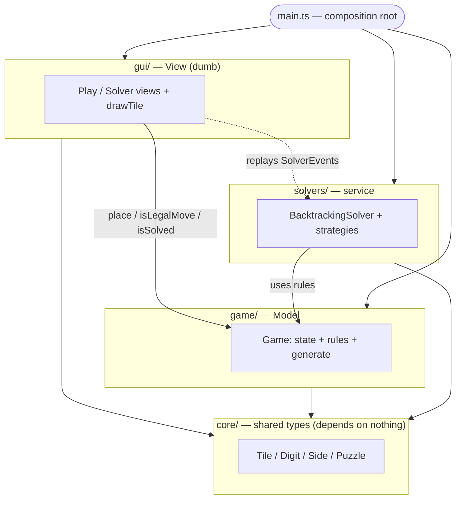

<h1 align="center">🧩 TetraVex Solver</h1>

<p align="center">
  <em>Play the TetraVex edge-matching puzzle — and watch a backtracking solver crack it, one decision at a time.</em>
</p>

<p align="center">
  
  
  
</p>

---

## What is TetraVex?

TetraVex is an `n×n` grid puzzle. You're given `n²` square tiles, each with a
digit on all four edges. Place every tile so that **touching edges show the
same digit** — every internal seam must agree.

> Each digit `0–9` is drawn on its own colored triangle, so a correct solution
> is also a clean, continuous color pattern. Tiles **never rotate** — only their
> position changes.

<p align="center">
  
  <br>
  <sub>The puzzle that started it — a 3×3 board with its tile pool (Game Nest app).</sub>
</p>

---

## Why this project

A learning playground for **search and constraint satisfaction**, runnable in
the browser so it's one link to share:

- **Play it** — interactive board, drag tiles from the pool, smooth snap.
- **Watch it solve** — a view renders the solver's every move: placements,
  rejections, and backtracks, live.
- **Compare strategies** — the same backtracking core, with progressively more
  pruning, swappable via `?solver=`.

<!-- TODO: drop real captures once the views are built -->
<p align="center">
  
  &nbsp;&nbsp;
  
  <br>
  <sub>Left: play mode. Right: solver mode. <em>(captures coming soon)</em></sub>
</p>

---

## How it works

**One shared algorithm for every solver:** depth-first search that fills the
grid in a fixed order — start top-left, go left→right, wrap to the next row,
top→bottom. Place a tile, recurse; on a dead end, remove it and try the next.
A `placed[]` array tracks which tiles are in use so backtracking is clean.

The solvers differ in **one thing only**: how hard they prune the set of tiles
worth trying at each cell. Brute force is impractical on its own — the real
project is layering optimizations onto the backtracking search.

| Strategy | Added optimization | Effect |
| --- | --- | --- |
| **brute-force** | none — try every unused tile | baseline, shows the cost of no pruning |
| **edge-match** | only try tiles whose top/left digits match the placed neighbors (linear scan) | cuts the vast majority of branches |
| **indexed** | same constraint via a `(side, digit) → tiles` map | removes the per-cell scan, instant candidate lookup |

The point is seeing **why** each refinement shrinks the search tree — watching
rejected branches vanish in the solver view.

---

## Architecture

An MVC split with strict, one-way dependencies. The **model** owns all state +
rules; the **view** is dumb (render + input only); the **solver** is a service;
`core` is the shared vocabulary everything speaks.



- **`game/` (Model)** — the only thing that mutates state. Exposes `place`,
  `isLegalMove`, `isSolved`, the tile pool, and puzzle `generate`.
- **`gui/` (View)** — renders the model and forwards user input; asks the model
  what's legal. Knows no rules, holds no search.
- **`solvers/` (service)** — input a `Puzzle`, output domain `SolverEvent`s the
  view replays. Uses the model's rules; never touches the GUI.
- **`core/`** — pure shared types. Depends on nothing; everyone depends on it.
- **`main.ts`** — the only place that constructs and wires the three together.

---

## Project layout

```
tetra_vex_solver/
├── index.html           mounts the app
├── package.json         scripts + deps (Vite, TypeScript)
├── tsconfig.json        strict TypeScript config
├── src/
│   ├── main.ts          composition root — constructs + wires model/view/solver
│   ├── core/            shared types — Tile, Digit, Side, Puzzle (no behavior)
│   ├── game/            Model — Game (state + rules) + generate()
│   ├── gui/             View — App loop, drawTile, playView, solverView
│   └── solvers/         service — shared backtracking core + pruning strategies
└── assets/              screenshots
```

The view and solver are decoupled through the domain: a solver emits
`SolverEvent`s, and the view replays them onto the model.

---

## Getting started

```bash
git clone https://github.com/<you>/tetra_vex_solver.git
cd tetra_vex_solver
npm install

npm run dev      # local dev server with hot reload
```

Then open the printed URL. Add `?mode=solve` to watch the solver, or
`?solver=edge-match` to pick a strategy.

```bash
npm run build    # type-check + production build to dist/
npm run preview  # serve the production build
```

---

## Roadmap

**Foundations**
- [ ] `game.generate()` — random *solvable* puzzles (build a valid board, shuffle the pool)
- [ ] Shared backtracking core in `base.ts` (row-major fill + `placed[]` + events)
- [ ] `drawTile` + `App` canvas loop

**Views**
- [ ] `PlayView` — drag-and-drop with eased snap + win detection
- [ ] `SolverView` — animated place / reject / backtrack, with a speed control

**Refining the backtracking solver** *(the core exploration)*
- [ ] edge-match pruning (only place tiles that fit the neighbors)
- [ ] indexed candidate lookup — `(side, digit) → tiles`
- [ ] most-constrained cell / fewest-candidates ordering
- [ ] forward-checking — detect a cell with zero candidates early
- [ ] side-by-side strategy comparison (steps, time, branches pruned)

**Stretch**
- [ ] larger boards (`4×4`, `5×5`)
```
