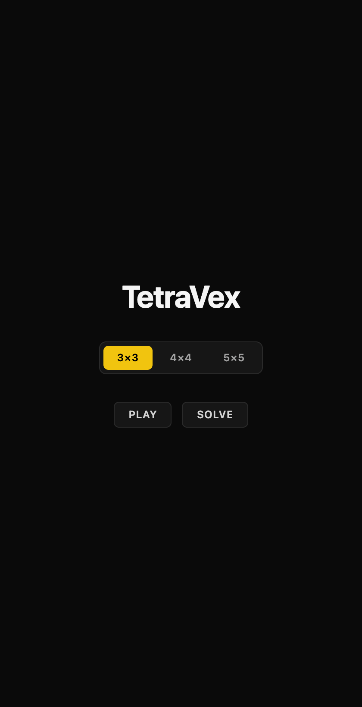
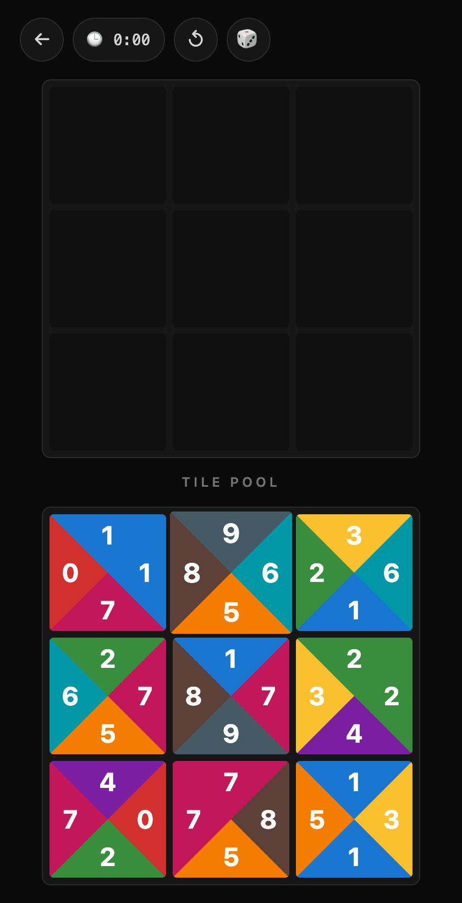
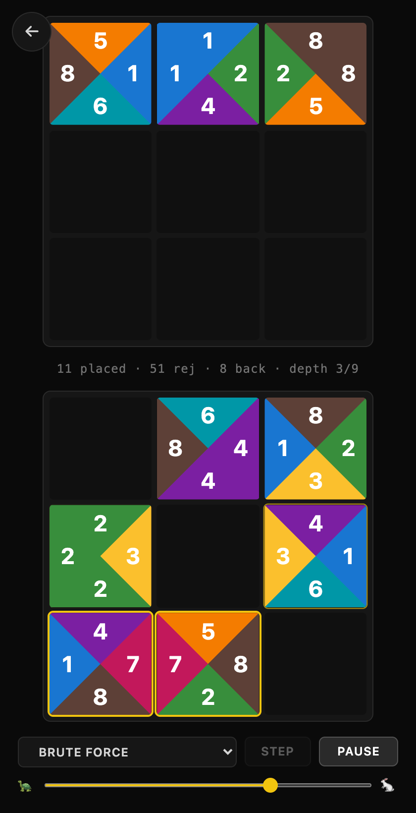
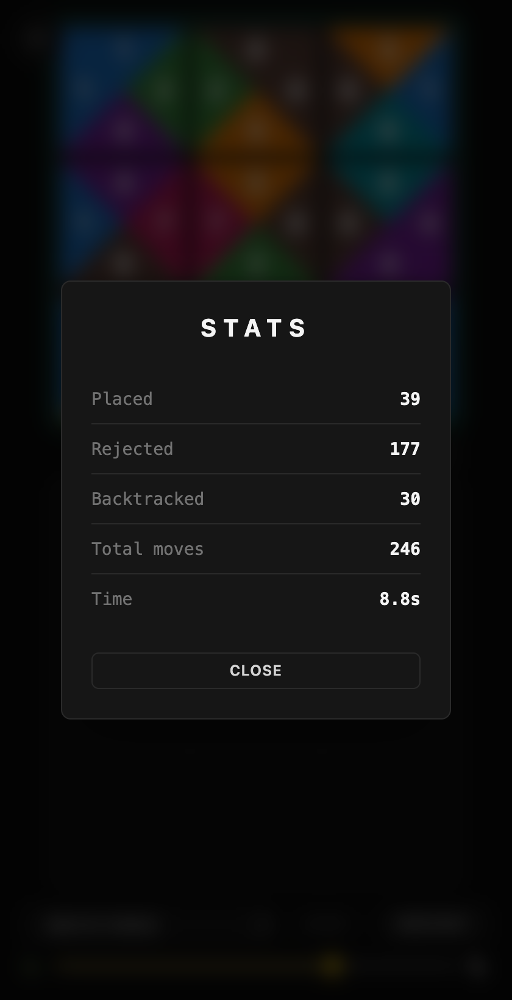

<h1 align="center">🧩 TetraVex Solver</h1>

<p align="center">
  <em>Play the TetraVex edge-matching puzzle — and watch backtracking solvers crack it, one decision at a time.</em>
</p>

<p align="center">
  
  
  
</p>

---

## What is TetraVex?

TetraVex is an `n×n` grid puzzle. You're given `n²` square tiles, each with a
digit on all four edges. Place every tile so that **touching edges show the
same digit** — every internal seam must agree.

> Each digit `0–9` is drawn on its own colored triangle, so a correct solution
> is also a clean, continuous color pattern. Tiles **never rotate** — only their
> position changes.

<p align="center">
  
  
  
  
</p>
<p align="center">
  <sub>Menu (3×3–5×5, play or solve) · play mode · solver mid-run (ringed pool tiles = current candidates) · final stats.</sub>
</p>

---

## Why this project

A learning playground for **search and constraint satisfaction**, runnable in
the browser so it's one link to share. The goal is to keep exploring **more
kinds of solvers** — different pruning, different orderings, different search
shapes — and to add **benchmarking and side-by-side comparisons** between them.

- **Play it** — interactive board, drag tiles from the pool, smooth snap, a
  timer, and your stats when you win.
- **Watch it solve** — the solver view renders every move live: placements,
  rejections, backtracks, and which pool tiles are candidates for the current
  cell (ringed). Pause, single-step, or crank the speed slider to the literal
  max.
- **Compare strategies** — the same event stream, progressively smarter
  searches, one dropdown apart. Stats (placed / rejected / backtracked / time)
  make the difference concrete.

---

## The solvers

Every solver extends one generic `BacktrackingSolver` (model, bookkeeping,
stats, `solve(): Generator<SolverEvent>`), so the GUI can replay any of them.
Two families so far:

**Row-major** (`solvers/rowMajor/`) — fixed fill order: left→right, top→bottom.
One shared recursion (`RowMajorSolver.step()`); each strategy overrides only
`candidatesFor(row, col)`:

| Solver           | Added optimization                                                                               | Effect                                          |
| ---------------- | ------------------------------------------------------------------------------------------------ | ------------------------------------------------ |
| **brute-force**  | none — try every unused tile                                                                      | baseline, shows the cost of no pruning           |
| **edge-match**   | only tiles whose edges match the placed neighbors (linear scan)                                   | cuts the vast majority of branches               |
| **border-first** | unpaired-edge analysis: a side no other tile can pair with must face the border — prune + prefer  | kills doomed subtrees before entering them       |
| **optimized**    | `(top,left)-digit → tiles` maps + border-first pruning                                            | O(matches) candidate lookup, zero reject events  |
| **indexed**      | `(side, digit) → tiles` map (stub — the plain lookup step)                                        | not yet implemented                              |

**Tile-driven** (`solvers/mrv/`) — no fixed fill order:

| Solver            | Idea                                                                                                                                            |
| ----------------- | ----------------------------------------------------------------------------------------------------------------------------------------------- |
| **scarcest-tile** | each step places the unplaced tile with the _fewest possible cells_ (fail-first); a tile with zero homes anywhere aborts the branch immediately |

The point is seeing **why** each refinement shrinks the search tree — watching
rejected branches vanish in the solver view.

---

## Architecture

An MVC split with strict, one-way dependencies. The **model** owns all state +
rules; the **view** is dumb (render + input only); the **solver** is a service;
`core` is the shared vocabulary everything speaks.


Dependencies point one way, into `core`. The view never mutates state except
through the model's methods; the solver emits `SolverEvent`s and never touches
the GUI.

### Patterns

- **Layered architecture** : `core` ← `game` ← `gui`/`solvers` ← `main` — dependencies only point inward.
- **MVC** : keep model, GUI, and rules separate.
- **Generator (`yield`)** : pause the solver mid-search — so you can watch, pause, single-step, and tune its speed.
- **Two views, one model** : the same game, played by a human (`PlayView`) or a robot (`SolverView`) — both drive the model the same way.
- **Template Method** : the generic `BacktrackingSolver` owns the plumbing; `RowMajorSolver` owns the row-major `step()` skeleton and strategies override only `candidatesFor()`. Families with a different search shape (like `scarcest-tile`) implement `solve()` themselves.
- **Shared rules** : edge-matching lives in one pure module (`game/rules.ts`), used by the model's `isLegalMove` and the solvers' pruning — the constraint is written once. Same for the unpaired-edge analysis (`forcedSides`), shared by two solvers.
- **Presentational components** : `gui/components` (Tile, Board, Pool, StatusRow, StatsDialog) render from props only; `gui/views` own state + input and compose them from the model.
- **Controller** : `PlayController` holds the move logic (place / swap / return / recall) as pure methods over the model — drag-mechanism-agnostic, so it's unit-tested without simulating the DOM.
- **Composition Root** : one file (`main.ts`) wires it all; `App` owns the menu → view lifecycle.
- **Pull events** : the solver doesn't know the UI — the UI asks for steps when it wants them.
- **Container-driven sizing** : the board measures the space actually left by the chrome (CSS container queries); every geometry value derives from one `--tile` variable, all in rem.

---

## Project layout

```
tetra_vex_solver/
├── index.html           mounts the app
├── package.json         scripts + deps (Vite, React, Tailwind, TypeScript)
├── src/
│   ├── main.ts          composition root
│   ├── core/            shared types — Tile, Digit, Side, Puzzle (no behavior)
│   ├── game/            Model — Game (state + rules) + rules.ts + generate()
│   ├── gui/             View (React + Tailwind)
│   │   ├── components/  presentational — Tile, Board, Pool, PlayScreen, StatusRow, StatsDialog
│   │   ├── controllers/ PlayController — move logic (place/swap/recall) + tests
│   │   └── views/       PlayView / SolverView — View-lifecycle adapters → React
│   └── solvers/         BacktrackingSolver base + events + tests
│       ├── rowMajor/    fixed-order family — bruteForce, edgeMatch, borderFirst, optimized
│       └── mrv/         tile-driven family — scarcestTile
├── public/              favicon.svg
└── assets/              screenshots
```

---

## Getting started

```bash
git clone https://github.com/LucianChirca/Tetra-Vex-Solver.git
cd Tetra-Vex-Solver
npm install

npm run dev        # local dev server with hot reload (also on your LAN IP)
```

Then open the printed URL — the dev/preview servers listen on `0.0.0.0`, so the
Network URL works from a phone on the same Wi-Fi. Pick a board size (3×3, 4×4,
5×5) and **Play** or **Solve** from the in-app menu.

```bash
npm run typecheck  # fast compile check
npm test           # Vitest (unit tests)
npm run lint       # ESLint (TS + React)
npm run format     # Prettier (sorts Tailwind classes)
npm run build      # type-check + production build to dist/
npm run preview    # serve the production build
```

---

## Progress

Done:

- `core/` + `game/` — types, edge rules, `Game`, solvable `generate()` for any size.
- Play mode — pointer drag-and-drop, swap, return-to-pool, win detection, timer,
  reset / new board, end-of-run stats.
- Solver mode — animated place / reject / backtrack, live candidate
  highlighting in the pool, pause / step / speed slider, stats modal.
- Five solvers: `brute-force`, `edge-match`, `border-first`, `optimized`
  (row-major) and `scarcest-tile` (tile-driven).
- Landing menu with board sizes 3×3 / 4×4 / 5×5.

## Roadmap

**More kinds of solvers** _(the core exploration)_

- [ ] `indexed` — the plain `(side, digit) → tiles` lookup step between edge-match and optimized
- [ ] forward-checking / constraint propagation variants
- [ ] other fill orders (spiral, border ring first)

**Benchmarking & comparison**

- [ ] side-by-side strategy comparison (steps, time, branches pruned)
- [ ] a non-yielding solver variant — the `yield`-per-decision generator makes
      the search watchable but costs speed; a silent runner would give honest
      timings
- [ ] benchmark harness: same boards, every solver, one table
