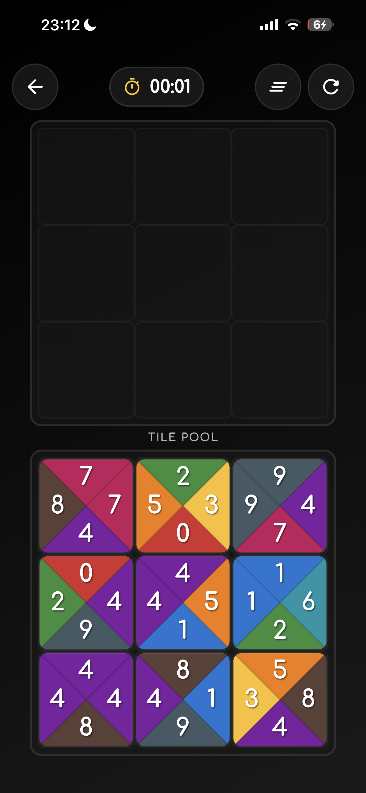
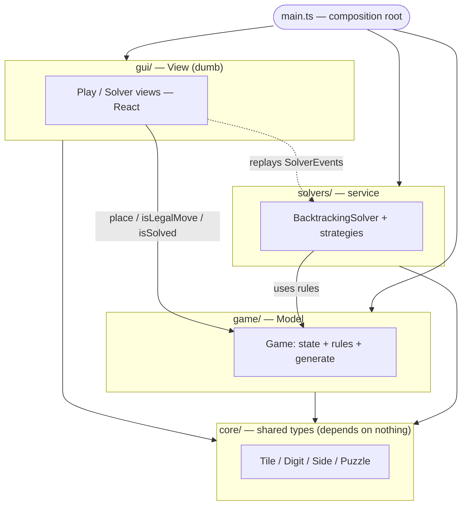

<h1 align="center">🧩 TetraVex Solver</h1>

<p align="center">
  <em>Play the TetraVex edge-matching puzzle — and watch a backtracking solver crack it, one decision at a time.</em>
</p>

<p align="center">
  
  
  
  
</p>

---

## What is TetraVex?

TetraVex is an `n×n` grid puzzle. You're given `n²` square tiles, each with a
digit on all four edges. Place every tile so that **touching edges show the
same digit** — every internal seam must agree.

> Each digit `0–9` is drawn on its own colored triangle, so a correct solution
> is also a clean, continuous color pattern. Tiles **never rotate** — only their
> position changes.

<p align="center">
  
  <br>
  <sub>The puzzle that started it — a 3×3 board with its tile pool (Game Nest app).</sub>
</p>

---

## Why this project

A learning playground for **search and constraint satisfaction**, runnable in
the browser so it's one link to share:

- **Play it** — interactive board, drag tiles from the pool, smooth snap.
- **Watch it solve** — a view renders the solver's every move: placements,
  rejections, and backtracks, live.
- **Compare strategies** — the same backtracking core, with progressively more
  pruning, swappable via `?solver=`.

---

## How it works

**One shared algorithm for every solver:** depth-first search that fills the
grid in a fixed order — start top-left, go left→right, wrap to the next row,
top→bottom. Place a tile, recurse; on a dead end, remove it and try the next.
A `placed[]` array tracks which tiles are in use so backtracking is clean.

The solvers differ in **one thing only**: how hard they prune the set of tiles
worth trying at each cell. Brute force is impractical on its own — the real
project is layering optimizations onto the backtracking search.

| Solver | Added optimization | Effect |
| --- | --- | --- |
| **brute-force** | none — try every unused tile | baseline, shows the cost of no pruning |
| **edge-match** | only try tiles whose top/left digits match the placed neighbors (linear scan) | cuts the vast majority of branches |
| **indexed** | same constraint via a `(side, digit) → tiles` map | removes the per-cell scan, instant candidate lookup |

The point is seeing **why** each refinement shrinks the search tree — watching
rejected branches vanish in the solver view.

---

## Architecture

An MVC split with strict, one-way dependencies. The **model** owns all state +
rules; the **view** is dumb (render + input only); the **solver** is a service;
`core` is the shared vocabulary everything speaks.



Dependencies point one way, into `core`. The view never mutates state except
through the model's methods; the solver emits `SolverEvent`s and never touches
the GUI.

### Patterns

- **Layered architecture** : `core` ← `game` ← `gui`/`solvers` ← `main` — dependencies only point inward.
- **MVC** : keep model, GUI, and rules separate.
- **Generator (`yield`)** : pause the solver mid-search — so you can watch, pause, and tune its speed.
- **Two views, one model** : the same game, played by a human (`PlayView`) or a robot (`SolverView`) — both drive the model the same way.
- **Template Method** : `base.ts` owns the `solve()`/`step()` traversal skeleton; each solver overrides only the `candidatesFor()` hook to swap pruning tricks without rewriting the search. Locking the fill order (left→right, top→bottom) keeps it simple and easy to watch — heuristic orderings can come later.
- **Shared rules** : edge-matching lives in one pure module (`game/rules.ts`), used by both the model's `isLegalMove` and the solvers' pruning — the constraint is written once.
- **Dependency Inversion** : swap solver or view without touching the other.
- **Composition Root** : one file (`main.ts`) wires it all.
- **Pull events** : the solver doesn't know the UI — the UI asks for steps when it wants them.

---

## Project layout

```
tetra_vex_solver/
├── index.html           mounts the app
├── package.json         scripts + deps (Vite, TypeScript)
├── tsconfig.json        strict TypeScript config
├── src/
│   ├── main.ts          composition root — constructs + wires model/view/solver
│   ├── core/            shared types — Tile, Digit, Side, Puzzle (no behavior)
│   ├── game/            Model — Game (state) + rules.ts (edge rule) + generate()
│   ├── gui/             View (React + Tailwind) — style.css palette entry
│   │   ├── components/  dumb presentational library — Tile, Board, Pool
│   │   └── views/       PlayView/SolverView — compose components from the model
│   └── solvers/         service — shared backtracking core + pruning strategies
└── assets/              screenshots
```

---

## Getting started

```bash
git clone https://github.com/LucianChirca/Tetra-Vex-Solver.git
cd Tetra-Vex-Solver
npm install

npm run dev        # local dev server with hot reload
```

Then open the printed URL. Add `?mode=solve` to watch the solver, or
`?solver=edge-match` to pick a strategy.

```bash
npm run typecheck  # fast compile check — the inner loop while implementing
npm run build      # type-check + production build to dist/
npm run preview    # serve the production build
```

---

## Implementing

Every function body is a stub right now — the scaffold is structure only.
Convention: value-returning stubs `throw new Error("not implemented")` (fail
loud); per-frame view hooks (`update`/`draw`/`handlePointer`) are empty `{}`.

Suggested order — each step only depends on the ones above it:

1. `core/types.ts` — already done (pure types).
2. `game/rules.ts` — the shared edge rule (`seamAgrees`), then `game/game.ts`: `isLegalMove`, `place`/`remove`, `isSolved`.
3. `game/generator.ts` — `generate()` random solvable puzzles.
4. `solvers/base.ts` — the shared `solve()`/`step()` traversal + events.
5. one strategy's `candidatesFor` (start with `edgeMatch`).
6. `gui/playView.tsx` — React board + pool + drag-and-drop (`style.css` is ready).
7. `gui/solverView.ts` — a stepper timer that pulls `SolverEvent`s.

> Tip: while implementing, you can flip `noUnusedLocals`/`noUnusedParameters`
> back on in `tsconfig.json` once bodies read their fields/params.

---

## Roadmap

**Foundations**
- [ ] `game.generate()` — random *solvable* puzzles (build a valid board, shuffle the pool)
- [ ] Shared backtracking core in `base.ts` (row-major fill + `placed[]` + events)
- [ ] DOM tile rendering + `style.css` (done) — board, pool, tile faces

**Views**
- [ ] `PlayView` — drag-and-drop with eased snap + win detection
- [ ] `SolverView` — animated place / reject / backtrack, with a speed control

**Refining the backtracking solver** *(the core exploration)*
- [ ] the three strategies in the table above (`brute-force` → `edge-match` → `indexed`)
- [ ] most-constrained cell / fewest-candidates ordering
- [ ] forward-checking — detect a cell with zero candidates early
- [ ] side-by-side strategy comparison (steps, time, branches pruned)

**Stretch**
- [ ] larger boards (`4×4`, `5×5`)

**Maybe / later**
- [ ] a non-yielding solver variant — the `yield`-per-decision generator is what
      makes the search watchable, but the per-step pause/resume costs speed. A
      separate solver that runs the same search without `yield` would be faster
      when you only want the answer, not the animation.
- [ ] benchmark yielding vs non-yielding (way later — only once both exist)
```
